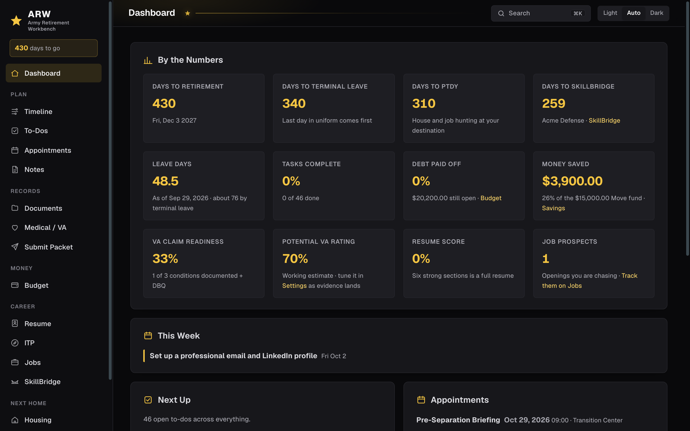
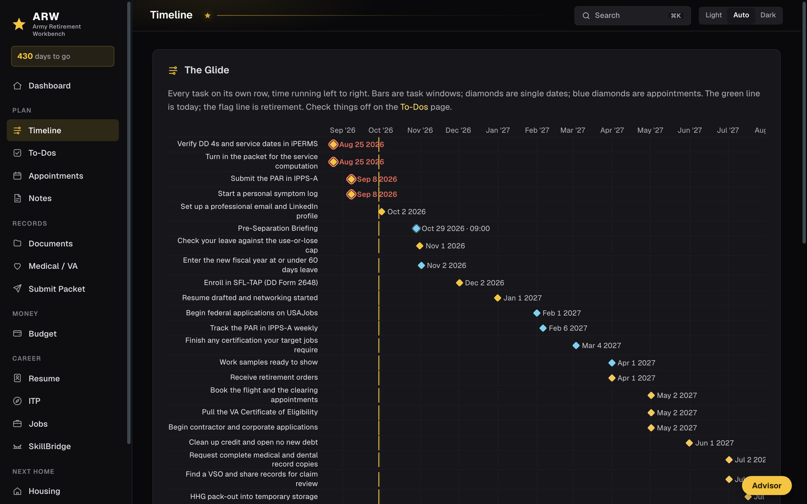
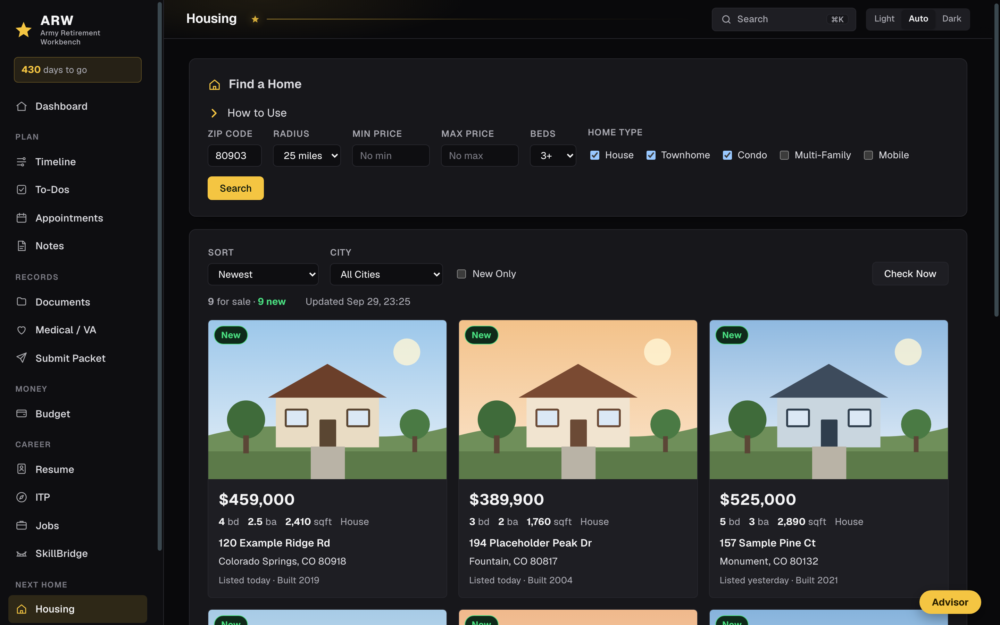

# ARW: Army Retirement Workbench

An AI-assisted Army retirement workbench: one private, single pane of glass
for your whole transition. Your timeline, to-do list, VA claim evidence,
budget and retired pay, resumes, job search, SkillBridge, and house hunt live
in one place on your own computer, and your records never leave it unless you
turn on a feature that needs the internet. Free and open source.

**It is for you if** you are within about two years of retiring or
separating and you are tired of tracking it all in notebooks, spreadsheets,
and a dozen websites.



## Get started

1. Download the file for your computer from the
   [releases page](../../releases).
2. Unzip it and open **ARW** (`ARW.app` on a Mac, `arw.exe` on Windows).
3. The app opens in your browser at `http://127.0.0.1:5252`.
4. Open **Settings**, enter your name, branch, and retirement date, and click
   **Save**.
5. Click **Generate My Timeline**. Your to-do list fills with the standard
   milestones, dated back from your retirement date.

| Computer | File to download |
|---|---|
| Any Mac (Apple silicon or Intel) | `ARW-...-macOS.zip` |
| Windows (most PCs) | `ARW-...-windows-x64.zip` |
| Windows on ARM (Surface Pro X and similar) | `ARW-...-windows-arm64.zip` |
| Linux | `ARW-...-linux-x64.tar.gz` or `-linux-arm64.tar.gz` |

Each download has a `QUICKSTART.txt` with these same steps.

The app is not signed by Apple or Microsoft yet, so your computer warns you
the first time. That warning is expected:

- **Mac:** right-click the app, choose **Open**, then choose **Open** again.
- **Windows:** on the blue SmartScreen box, choose **More info**, then
  **Run anyway**.

**Use a personal computer.** Do not install this on a government computer.
Your unit's IT rules forbid unapproved software, and your retirement records
belong on a machine you control.

ARW runs in the background while you use it, and your data saves as you go.
To stop it, go to **Settings** and click **Quit ARW**. Opening ARW again
while it is still running brings it back up in your browser.

Want to look around first? In **Settings**, click **Load Example Data**. It
fills the app with a fictional soldier, SFC John Doe, that you can erase
later.

## What you can do

| When you need to | Go to |
|---|---|
| See every deadline from packet to retirement day on one chart | **Timeline** |
| Keep one checklist, and write down what people tell you | **To-Dos**, **Notes** |
| Track appointments, including TAP classes and C&P exams | **Appointments** |
| Store orders, DD 214s, medical records, and forms | **Documents** |
| Build your VA claim evidence and estimate your combined rating | **Medical / VA** |
| Work the PAR step by step and combine your packet into one PDF | **Submit Packet** |
| Plan your budget, debt payoff, savings, and retired pay | **Budget**, **Debt**, **Savings**, and **Retired Pay** |
| See federal and state tax on your retired pay in the state you plan to retire in | **Retired Pay** |
| Write a tailored resume per job, pick its design, font, and colors, and download it as a PDF | **Resume** |
| Find jobs near a ZIP code or remote, and track every opening | **Jobs** |
| Find a SkillBridge program, track leads, work the packet, and download your request memo | **SkillBridge** |
| Watch homes for sale where you are moving | **Housing** |
| Check the weather where you are and where you plan to retire | **Dashboard** |

<table><tr>
<td></td>
<td></td>
</tr><tr>
<td align="center">Timeline: every milestone, counted back from your retirement date</td>
<td align="center">Housing: homes for sale where you are moving, updated every 30 minutes</td>
</tr></table>

Screenshots use the built-in example data: a fictional soldier and fictional listings.

Press **⌘K** on a Mac or **Ctrl+K** on Windows from any page to search
everything: tasks, notes, documents, contacts, and pages.

## Turn on optional features

Everything works without these. Each one needs a free sign-up or a plan you
already have, and each one is off until you turn it on in **Settings**.

| Feature | What you need | What it adds |
|---|---|---|
| Advisor | Claude Pro or Max, or ChatGPT Plus or Pro | Ask questions about your own numbers, or tell it to add tasks, log savings, or write resume bullets |
| Federal jobs | A free key from [developer.usajobs.gov](https://developer.usajobs.gov) | USAJOBS results inside the app |
| All other jobs | A free key from [developer.adzuna.com](https://developer.adzuna.com) | Private-sector results inside the app |
| Housing | Your destination ZIP code, on the **Housing** page | Homes for sale, updated every 30 minutes |
| Weather | Where you are now and where you plan to retire, in **Settings** (a US ZIP code or any city) | Current weather and a 3-day outlook for both places on the Dashboard, from [Open-Meteo](https://open-meteo.com) |

### Set up the Advisor

The Advisor uses the AI plan you already pay for, through that company's own
app. You do not need an API key or a business account.

1. Install [Node.js](https://nodejs.org).
2. Install and sign in to one of these:

   | Plan | Install | Sign in once |
   |---|---|---|
   | Claude Pro or Max | `npm install -g @anthropic-ai/claude-code` | run `claude`, then type `/login` |
   | ChatGPT Plus or Pro | `npm install -g @openai/codex` | run `codex login`, then choose **Sign in with ChatGPT** |

3. In **Settings**, choose **Claude** or **ChatGPT** under **Advisor**, and click
   **Save**.

The Advisor panel appears on the right of every page.

## Keep your data safe

Your data lives in one folder on your computer. **Settings** shows where.

- **Back up:** in **Settings**, click **Back Up Everything**. You get one zip
  file with all your data and documents. Copy it to a USB drive.
- **Move to a new computer:** install the app there, then in **Settings**,
  choose the zip under **Restore a Backup**.
- **Start over:** in **Settings**, click **Erase Everything and Start Fresh**.
  That deletes your data and your uploaded documents.

The app reaches the internet only for the features you turn on above. It
never sends anything to the Army, the VA, or its authors.

## Questions

**Does it cost anything?** No. It is free and open source under the MIT
license, and it always will be.

**Is this official?** No. It is a planning tool made by a soldier, not
guidance from the Department of Defense, the Army, or the VA. Confirm every
date, form, and decision with your transition counselor, your unit S-1, and an
accredited Veterans Service Officer. Rating and pay figures are estimates.

**I am not in the Army.** Most of it works for any branch. The timeline and
the PAR steps follow the Army process, so edit what does not fit.

**Something is broken.** [Open an issue](../../issues/new/choose). Do not
include any real personal information. Reproduce it with the example data if
you can.

---

## For engineers

Army Retirement Workbench is one Go binary with no dependencies outside the
standard library. It serves server-rendered HTML on `127.0.0.1` and keeps its
state in one JSON file. [docs/ARCHITECTURE.md](docs/ARCHITECTURE.md) explains
each design decision and the alternatives it beat.

### Build and test

You need [Go](https://go.dev/dl/) 1.25 or newer.

```bash
git clone https://github.com/joshkor1982/retirement-workbench.git
cd retirement-workbench
go test -race ./...    # unit tests plus end-to-end journeys through every page
go run .               # opens http://127.0.0.1:5252
scripts/build-release.sh v1.0.0   # every download, into dist/
```

`go test` prints `ok  github.com/joshkor1982/retirement-workbench` when everything passes. CI runs the
same tests, `gofmt`, `go vet`, builds for five platforms, and a container
health check on every pull request.

### Options

| Flag | Environment variable | Default | What it does |
|---|---|---|---|
| `-port` | | `5252` | Port on `127.0.0.1` |
| `-addr` | `RW_ADDR` | | Full listen address, such as `0.0.0.0:5252` in a container |
| `-data` | `RW_DATA` | your app data folder | Where your data lives |
| `-open` | `RW_OPEN_BROWSER` | on | Opens the browser at start; `0` turns it off |
| | `RW_ALLOWED_HOSTS` | | Extra host names to answer on, for use behind a login proxy |
| | `RW_BROWSER` | found automatically | Chrome, Edge, or Brave, used to print resume PDFs |
| `-version` | | | Prints the version |

The default data folder is `~/Library/Application Support/RetirementWorkbench`
on a Mac, `~/.config/RetirementWorkbench` on Linux, and
`%AppData%\RetirementWorkbench` on Windows.

### Run it in Docker

The standalone app is the main way to run it. A container works for a home
server:

```bash
docker compose up -d   # then open http://localhost:5252
```

Data lives in the `workbench-data` volume and survives restarts and upgrades.
The port is published on `127.0.0.1` only, because the app has no login.
Inside the container the Advisor is off, packet PDFs combine through
`pdfunite`, and resume PDFs open a print page instead of downloading.

### Project layout

| Path | What it holds |
|---|---|
| `main.go` | Store, routes, and the core pages: timeline, to-dos, budget, medical, resume, jobs |
| `ai.go` | The Claude and ChatGPT command-line bridge |
| `security.go` | Cross-site request and DNS-rebinding protection |
| `datadir.go` | Where data lives, file paths, and calendar dates |
| `backup.go` | Backup and restore |
| `search.go` | Quick search |
| `skillbridge.go` | SkillBridge search, leads, packet, and the request memo |
| One file per feature | `housing.go`, `jobsearch.go`, `savings.go`, `leave.go`, `retirepay.go`, `notes.go`, `par.go`, `resume_pdf.go`, `resume_style.go`, `flash.go` |
| `templates/`, `static/` | HTML templates, design tokens, and styles |
| `app_test.go` | Unit tests and end-to-end journeys |

See [CONTRIBUTING.md](CONTRIBUTING.md) before you open a pull request, and
[SECURITY.md](SECURITY.md) to report a security problem.

## License

[MIT](LICENSE). Free for anyone to use, change, and share.

Tax figures come from IRS Rev. Proc. 2025-32 (federal, 2026) and Tax
Foundation's 2026 state income tax table, regenerated with
[scripts/statetax](scripts/statetax). How each state treats military retired
pay follows the Army's Soldier for Life newsletters. States change these rules
often; check yours before you decide where to retire.

The app's interface fonts (Barlow and Barlow Semi Condensed, license in
[static/fonts/ui](static/fonts/ui)), Geist and Geist Mono, and the resume fonts
(Inter, IBM Plex Sans, Source Sans 3, Source Serif 4, Lora, and EB Garamond)
are included under the [SIL Open Font License 1.1](static/fonts/OFL.txt). Each
resume font's license is in [static/fonts/resume](static/fonts/resume).
